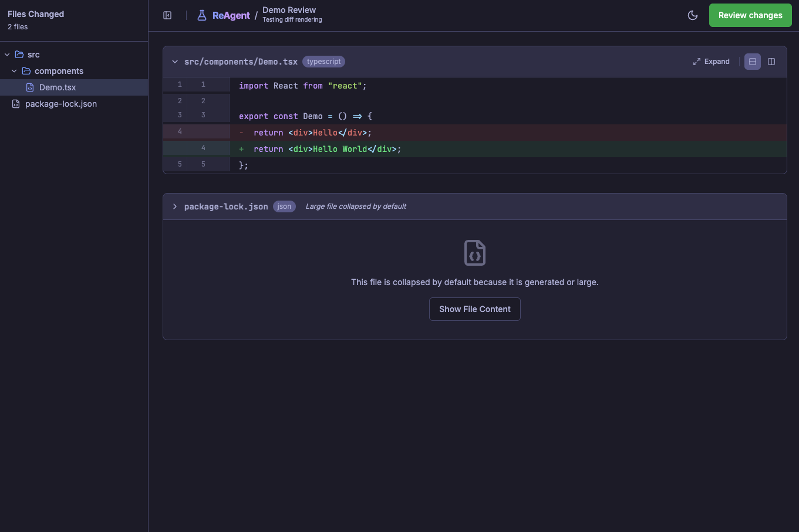

# Reagent

**Give your AI coding agents targeted feedback, just like you would with human engineers.**

When working with AI coding assistants like Claude Code, you often need to provide detailed, line-specific feedback on their generated code. But pointing to specific lines through chat is clunky, and setting up GitHub PRs for local work-in-progress is overkill.

Reagent is a lightweight MCP server that opens a familiar, GitHub-style review interface right in your browser—no external tools, no overhead. Just seamless code reviews for the code already on your machine.



## Why Reagent?

- **Communicate naturally**: Line-level comments are clearer than "change line 42 in app.ts"
- **Stay in flow**: Review AI-generated code without context-switching to external platforms
- **Work locally**: Everything runs on your machine—no GitHub setup required for WIP code
- **Git-native**: Works with uncommitted changes, commits, and branches using tools you already know

## Features

- Interactive browser-based code review UI
- Line-level comments with file tree navigation
- Approve or request changes workflow
- Git integration: review uncommitted changes, specific commits, or branch diffs
- Works with directories (recursive review)

## Installation

```bash
npm install
npm run build
```

## Usage

### As an MCP Server

Add to your Claude Code MCP configuration:

```json
{
  "mcpServers": {
    "reagent": {
      "command": "node",
      "args": ["/path/to/reagent/dist/index.js"]
    }
  }
}
```

### Using the Tool

Reagent supports two input modes:

#### 1. Git Mode (Recommended)

> Tip: Calling `ask_for_review` with no arguments will automatically review all uncommitted changes
> in your current git repository.

Review uncommitted changes:
```json
{
  "files": ["src/app.ts", "src/utils.ts"],
  "source": "uncommitted"
}
```

Review a specific commit:
```json
{
  "files": ["src/app.ts"],
  "source": "commit",
  "commitHash": "abc123"
}
```

> When `commitHash` or `base/head` are provided, Reagent automatically switches to commit or
> branch comparison mode even if you omit the `source` field.

Compare branches:
```json
{
  "files": ["src/app.ts"],
  "source": "branch",
  "base": "main",
  "head": "feature-branch"
}
```

Review every file inside a directory (recursively):
```json
{
  "files": ["src/ui"],
  "source": "uncommitted"
}
```

See [GIT_USAGE.md](./GIT_USAGE.md) for comprehensive git integration documentation.

### Return Value

Each review returns the same format:

```typescript
{
  "status": "approved" | "changes_requested",
  "generalFeedback": "Overall review comments",
  "comments": [
    {
      "filePath": "src/example.ts",
      "lineNumber": 42,
      "text": "Comment text"
    }
  ]
}
```

## License

MIT
