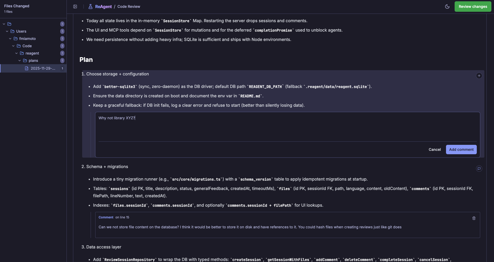

# ReAgent 

> **Re**views for your **Agent**

## Why is this useful?

In the era of AI coding assistants, ensuring their output code is high quality is essential for maintaining a healthy codebase. 

This often requires providing detailed, line-specific feedback, just like you would with a human teammate's code.

But pointing to specific lines through chat is clunky, and setting up GitHub PRs for local work-in-progress is really overkill.

ReAgent tackles that by creating a lightweight MCP server that opens a familiar, GitHub-style review interface right in your browser to speed your feedback cycles.




## Features

- Interactive browser-based code review UI
- Line-level comments with file tree navigation
- Approve or request changes workflow
- Git integration: review uncommitted changes, specific commits, or branch diffs
- Local file review: review arbitrary files

## Usage

1. Add it as an MCP server to your favorite agentic coding tool.

```json
{
  "mcpServers": {
    "reagent": {
      "command": "npx",
      "args": [
        "-y",
        "@fsmiamoto/reagent@latest",
        "mcp"
      ]
    }
  }
}
```

### Prompting

The recommended way to use ReAgent is to steer your agent whenever you want to create a review session.

```
> Let's plan a change to [...]. Write the plan as a markdown file on the plans/ directory and create a review session.
```

You can also add ReAgent instructions to your AGENTS.md (or any context file your agent loads) to enforce reviews automatically:

```
- You MUST create a review session using ReAgent and get approval before proceeding to implementation.
```

### Two-Step Workflow

ReAgent uses a two-step workflow to enable interactive browser-based code reviews:

1. **create_review**: Initiates a review session and returns a URL.
2. **get_review**: Retrieves the completed review results.

## CLI Usage

ReAgent also provides a command-line interface for creating and managing review sessions.

For advanced users, you can also use the CLI directly without MCP by teaching your agent to invoke the commands ([learn more](https://mariozechner.at/posts/2025-11-02-what-if-you-dont-need-mcp/)).

### Installation

Install ReAgent globally to use the CLI:

```bash
npm install -g @fsmiamoto/reagent
```

Verify installation:

```bash
reagent --version
```

Alternatively, use `npx` without installation:

```bash
npx @fsmiamoto/reagent review
```

### Creating a Review

The most common CLI workflow is creating a review of your code:

```bash
# This will review all the uncommitted changes in your Git repo.
reagent review --auto-start
```

The `--auto-start` flag automatically starts the server if it's not already running. 

By default, the review URL will open in your browser.

## License

MIT
